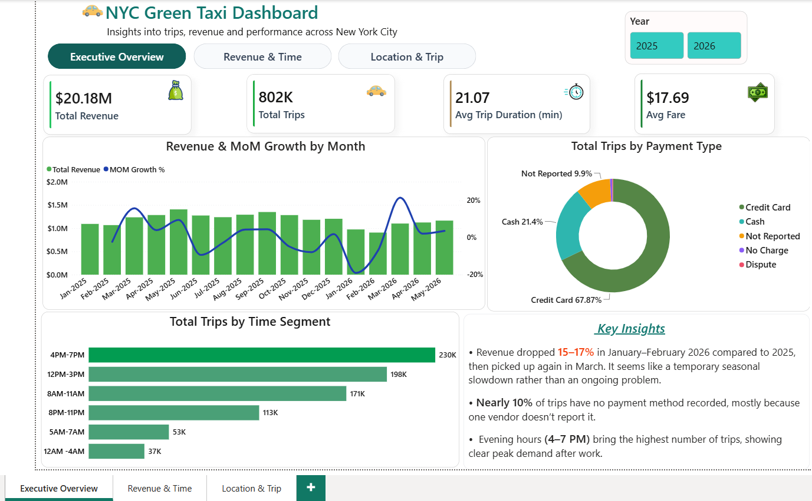
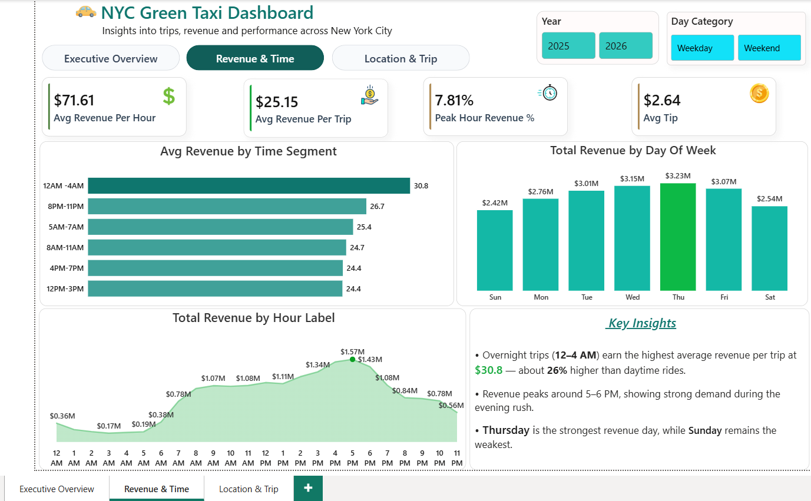
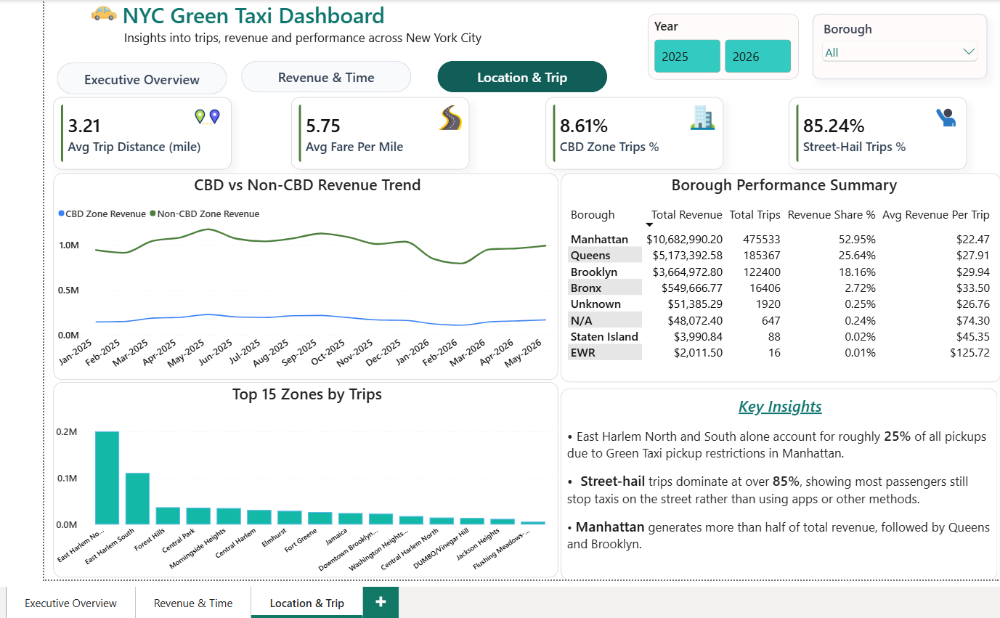

# 🚕 NYC Green Taxi Analytics (2025–2026)

**End-to-end data analysis project** covering 17 months of NYC Green Taxi trip data (Jan 2025 – May 2026, ~800K trips) using **SQL (PostgreSQL)** for analysis and **Power BI** for visualization — focused on revenue trends, demand patterns, congestion pricing impact, and data quality.

---

## 📑 Table of Contents

- [Project Overview](#-project-overview)
- [Business Problem](#-business-problem)
- [Key Business Questions Explored](#-key-business-questions-explored)
- [Dataset](#️-dataset)
- [Data Cleaning & Quality Notes](#-data-cleaning--quality-notes)
- [Tools & Tech Stack](#️-tools--tech-stack)
- [Screenshots](#-screenshots)
- [Key Findings](#-key-findings)
- [Business Recommendations](#-business-recommendations)
- [Repository Structure](#-repository-structure)
- [How to Run](#️-how-to-run)
- [Connect With Me](#-connect-with-me)

---

## 📌 Project Overview

Green taxis (Street-Hail Liveries) were introduced by NYC TLC in 2013 to expand taxi access in the outer boroughs and upper Manhattan — areas historically underserved by yellow cabs. This project analyzes trip-level data to understand revenue performance, temporal demand patterns, and the real-world impact of NYC's Congestion Relief Zone (CRZ) toll, which took effect in January 2025 — a period this dataset fully covers.

Using **SQL (PostgreSQL)** and **Power BI**, I explored revenue trends, demand patterns, borough and zone performance, and the fare impact of congestion pricing — turning raw trip records into a 3-page interactive dashboard and actionable business findings.

---

## 📌 Business Problem

Green taxi operators and city planners need to understand where and when demand is concentrated, how revenue changes across time and geography, and how congestion pricing affects trip economics.

This project uses trip-level data to answer:

- Where is revenue being generated?
- When is demand highest?
- Which locations perform best?
- How does congestion pricing affect trip economics?
- What data quality issues need attention?

---

## ❓ Key Business Questions Explored

1. How does monthly revenue trend, and which months show growth vs. decline?
2. Which time-of-day segments generate the highest trip volume and revenue?
3. Does trip volume correlate with revenue, or do they peak at different times?
4. Which boroughs and zones drive the most trips and revenue?
5. What fare premium (if any) applies to trips touching the Congestion Relief Zone?
6. How does average fare per mile change across trip-distance buckets?
7. What share of trips are street-hail vs. dispatch, and does that match Green Taxi's original mandate?
8. Where are the data quality issues (missing/invalid values), and how were they handled?

> ✨ *...and additional insights derived from 20+ SQL queries across 7 analysis categories.*

---

## 🗂️ Dataset

| Property | Details |
|---|---|
| Source | [NYC TLC Trip Record Data](https://www.nyc.gov/site/tlc/about/tlc-trip-record-data.page) (official) |
| Period | January 2025 – May 2026 (17 months) |
| Total Rows | ~802,000 trips |
| Format | Monthly Parquet files, merged into a single CSV |
| Reference tables | [NYC TLC Taxi Zone Lookup](https://www.nyc.gov/site/tlc/about/tlc-trip-record-data.page) · [MTA Congestion Relief Zone Taxi Zones](https://data.ny.gov/Transportation/MTA-Central-Business-District-Taxi-Zones/yfdc-w5jh) |

**Note:** Raw data was sourced directly from NYC TLC and MTA official portals — no third-party or unverified sources were used.

---

## 🧹 Data Cleaning & Quality Notes

Data quality issues were identified, quantified, and explicitly flagged rather than silently dropped from the base dataset:

| Issue | Scope | Handling |
|---|---|---|
| Negative `fare_amount` / `total_amount` | ~2,345 / 2,393 rows | Flagged; excluded only in fare-specific queries |
| `trip_distance = 0` | 31,707 rows | Flagged as likely GPS/meter error; excluded from distance analysis |
| `RatecodeID` missing or `99` (Unknown) | ~79,435 + 327 rows | Retained, labeled "Unknown" — not dropped |
| `payment_type` = No Charge / Dispute / Unknown | Minor % of trips | Grouped as "Other" for reporting |
| CBD zone flag | Derived | Cross-verified against official MTA polygon dataset (39 zones confirmed) |

---

## 🛠️ Tools & Tech Stack

| Tool | Purpose |
|---|---|
| Python (Pandas) | Dataset merging & pre-processing |
| PostgreSQL | Data storage & SQL queries |
| pgAdmin 4 | Query execution & output |
| Power BI | Interactive 3-page dashboard, DAX measures |

---

## 📸 Screenshots

Power BI Dashboard shows:
- Revenue trends & month-over-month growth
- Time-of-day & day-of-week demand patterns
- Borough and zone-level performance
- Congestion Relief Zone fare impact
- Trip-distance pricing patterns

### Page 1 — Executive Overview
High-level snapshot: total revenue, trips, average fare, and payment mix — with month-over-month revenue growth highlighted.



### Page 2 — Revenue & Time Analysis
Demand and revenue patterns across hours, days, and time segments — including a weekend vs. weekday revenue split.



### Page 3 — Location & Trip Analysis
Borough and zone-level performance, the Congestion Relief Zone's fare impact, and trip-distance pricing patterns.



📁 Interactive file: [`dashboard/NYC_Green_Taxi_Dashboard.pbix`](./dashboard/NYC_Green_Taxi_Dashboard.pbix)

---

## 🔍 Key Findings

- 💰 **CBD trips punch above their weight** — only **8.6%** of trips touch the Congestion Relief Zone, yet they carry an **84% higher average fare** ($30.30 vs. $16.50)
- 📍 **Demand is geographically concentrated** — East Harlem North & South alone drive **~25%** of all pickups, consistent with Green Taxi's restriction from core Manhattan (below ~96th St)
- 🌙 **Volume and value don't peak together** — overnight trips (12–4 AM) earn **~26% higher** average revenue per trip despite the lowest trip volume, pointing to longer-distance or airport rides
- 📅 **Weekday-dominant demand** — weekends generate only **24.6%** of revenue despite covering 28.6% of the week
- 🚖 **~85% of trips are street-hail**, consistent with Green Taxi's original 2013 mandate to expand curb access in the outer boroughs
- 🧾 **Data quality handled transparently** — ~10% of trips have no recorded payment method, traced to a single non-reporting vendor and labeled "Not Reported" rather than dropped

> ⚠️ *Key Findings will be updated as analysis progresses.*

---

## 💡 Business Recommendations

1. **Focus more drivers around CBD-adjacent areas during high-fare periods**
   CBD trips are a small share of total trips but generate much higher fares. Better driver availability in nearby areas could help increase revenue per trip.

2. **Look more closely at overnight trips**
   Trips between 12–4 AM generate higher revenue per trip despite lower volume. Checking how many of these trips are airport-related or longer-distance could help improve overnight planning.

3. **Keep strong coverage in East Harlem North & South**
   These two zones account for about a quarter of all pickups. Keeping enough drivers there can help maintain reliable service in the areas with the highest demand.

4. **Keep tracking the effect of congestion pricing**
   The current data shows an early picture of how the Congestion Relief Zone affects fares. More months of data will help confirm whether this pattern continues.

5. **Follow up on the missing payment data**
   Around 10% of trips have no recorded payment method, and most of this missing data comes from one vendor. This should be reviewed with that vendor.

6. **Use weekday demand when planning driver schedules**
   Weekdays generate a larger share of revenue than weekends. Driver scheduling and incentives can reflect this demand pattern instead of using the same approach every day.

---

## 📁 Repository Structure

```text
nyc-green-taxi-analytics/
│
├── README.md
│
├── sql/
│   ├── 01_data_overview.sql
│   ├── 02_revenue_analysis.sql
│   ├── 03_temporal_demand_analysis.sql
│   ├── 04_location_analysis.sql
│   ├── 05_cbd_congestion_analysis.sql
│   ├── 06_fare_payment_analysis.sql
│   └── 07_trip_distance_analysis.sql
│
├── data/
│   ├── green_taxi_trips_2025_2026.csv
│   ├── taxi_zone_lookup.csv
│   └── cbd_zone_lookup.csv
│
├── dashboard/
│   └── NYC_Green_Taxi_Dashboard.pbix
│
└── screenshots/
    ├── page1_executive_overview.png
    ├── page2_revenue_time.png
    └── page3_location_trip.png
```

---

## ▶️ How to Run

1. Clone this repository.
2. Use the files in the `data/` folder.
3. Create a new database in PostgreSQL.
4. Import `green_taxi_trips_2025_2026.csv` into a table named `green_taxi`, and import the two lookup CSVs into their own tables.
5. Run the SQL queries from the `sql/` folder.
6. Open `dashboard/NYC_Green_Taxi_Dashboard.pbix` in Power BI Desktop.
7. Open the images in `screenshots/` to preview the dashboard pages.

---

## 📬 Connect With Me

**Rafat Khan** — Data Analyst

- 💼 LinkedIn: https://www.linkedin.com/in/rafat-khan-7215953a1/
- 🐙 GitHub: https://github.com/Rafat-khan10
- 📧 Email: rafatkhan2210@gmail.com
